# SafeZoneSlemanGIS

"SafeZoneSlemanGIS" adalah sistem informasi geografis yang digunakan untuk menganalisis dan memvisualisasikan distribusi titik-titik strategis dalam pertahanan dan keamanan wilayah Sleman. Dengan menggunakan teknologi GIS, sistem ini membantu memahami penempatan pos keamanan, pangkalan militer, dan elemen kunci lainnya secara digital. Ini memungkinkan pengguna untuk mendapatkan gambaran yang lebih baik tentang struktur pertahanan dan keamanan di Sleman, memudahkan pengambilan keputusan strategis dan perencanaan efektif.

Komponen yang digunakan:
1. Xampp
2. Geoserver
3. Visual Studio
4. W3schools
5. ApexCharts
6. Fontawesome
7. PHPMyAdmin

<h2>Sumber Data:</h2>

<ul>
  <li><a href="https://geoportal.slemankab.go.id/">Geoportal Kabupaten Sleman</a></li>
  <li><a href="https://geoportal.slemankab.go.id/search/?title__icontains=SEBARAN%20FASILITAS%20PERTAHANAN%20DAN%20KEAMANAN%20DI%20KABUPATEN%20SLEMAN%20TAHUN%202019&abstract__icontains=SEBARAN%20FASILITAS%20PERTAHANAN%20DAN%20KEAMANAN%20DI%20KABUPATEN%20SLEMAN%20TAHUN%202019&purpose__icontains=SEBARAN%20FASILITAS%20PERTAHANAN%20DAN%20KEAMANAN%20DI%20KABUPATEN%20SLEMAN%20TAHUN%202019&f_method=or&limit=5&offset=0">Data Sebaran Fasilitas Pertahanan Dan Kemanan</a></li>
 <li><a href="https://geoportal.slemankab.go.id/">Data Sebaran Pos Kamling Kabupaten Sleman</a></li>
</ul>

<h2>Tangkapan Layar Sumber Data</h2>
<ol>
  <li>ApexCharts</li> 
  <li>PHPMyAdmin</li> 
  <li>Geoserver</li> 
  <li>WSchools</li> 
   <li>FontAwesome</li> 
</ol>

<h2>Tangkapan Layar Komponen Penting</h2>
<ol>
  <li>ApexCharts</li> 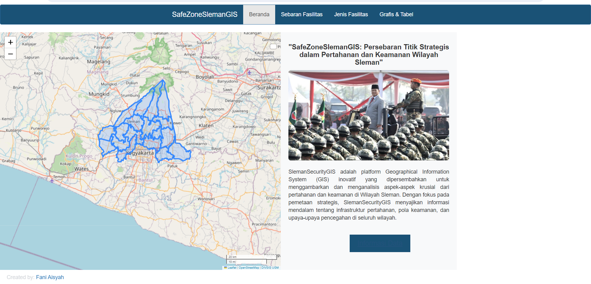
  <h2>Tangkapan Layar Komponen Penting</h2>
  <li>ApexCharts</li> 
  <li>ApexCharts</li> 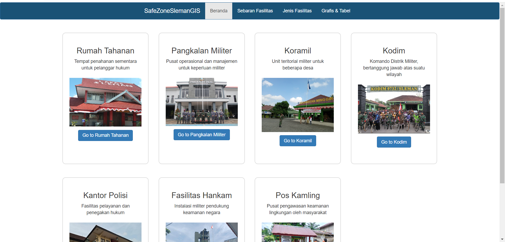
  <li>ApexCharts</li> 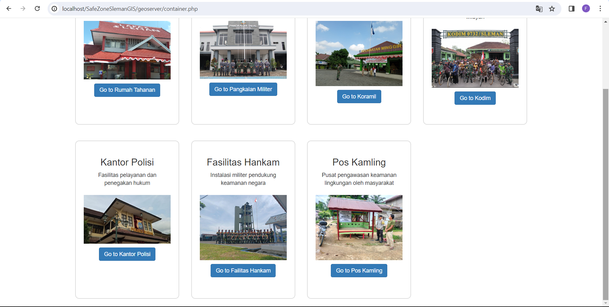
  <li>ApexCharts</li> 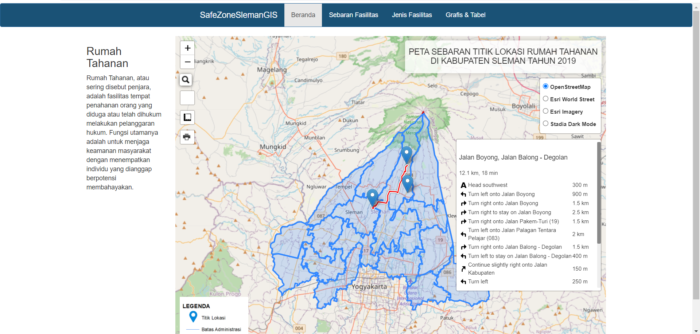
  <li>ApexCharts</li> 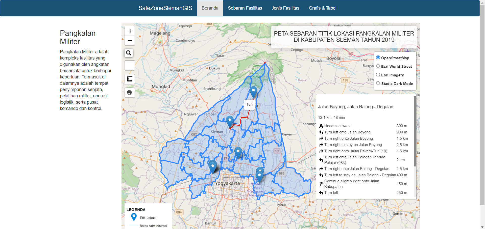
  <li>ApexCharts</li> 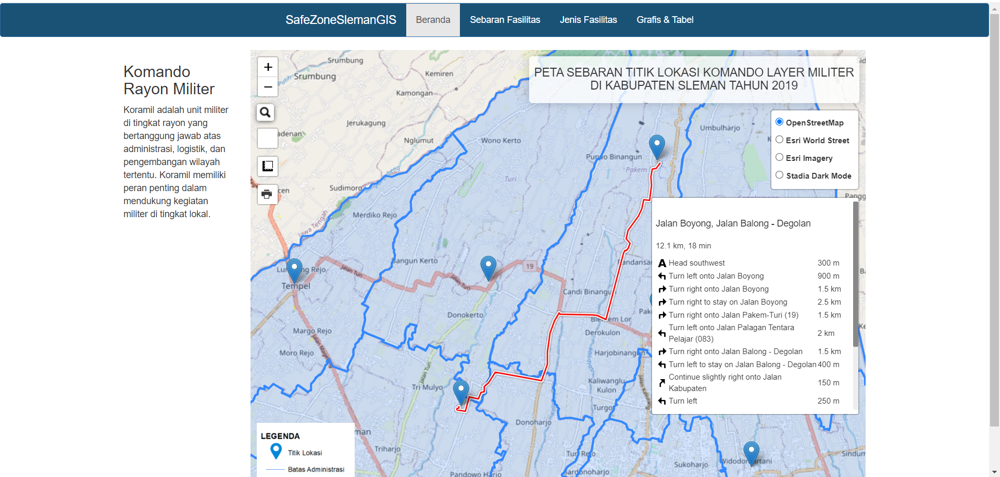
  <li>ApexCharts</li> 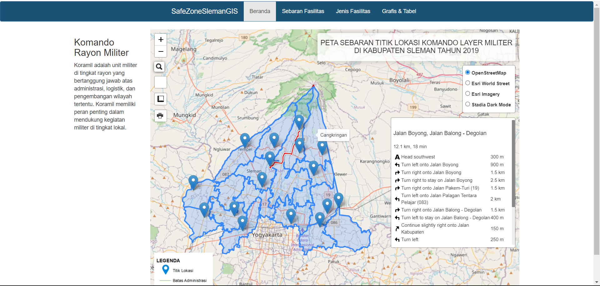
  <li>ApexCharts</li> 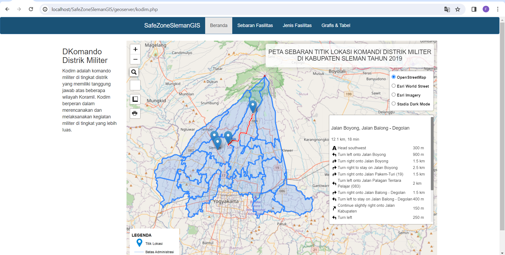
  <li>ApexCharts</li> 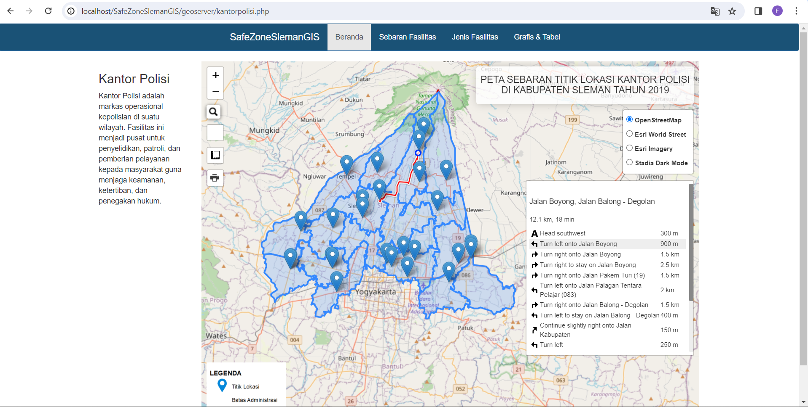
  <li>ApexCharts</li> 
  <li>ApexCharts</li> 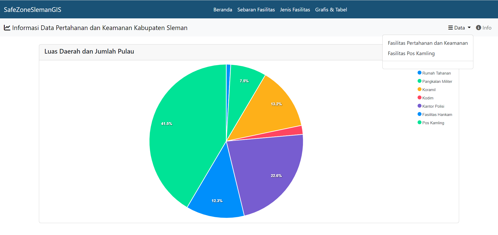
  <li>ApexCharts</li> 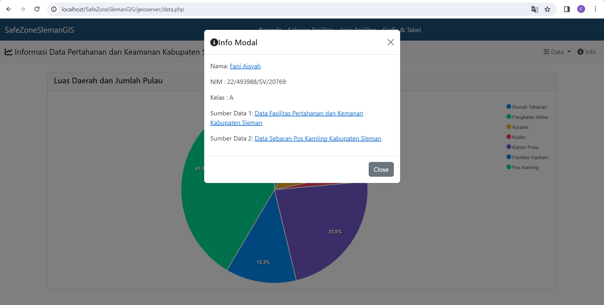
  <li>ApexCharts</li> 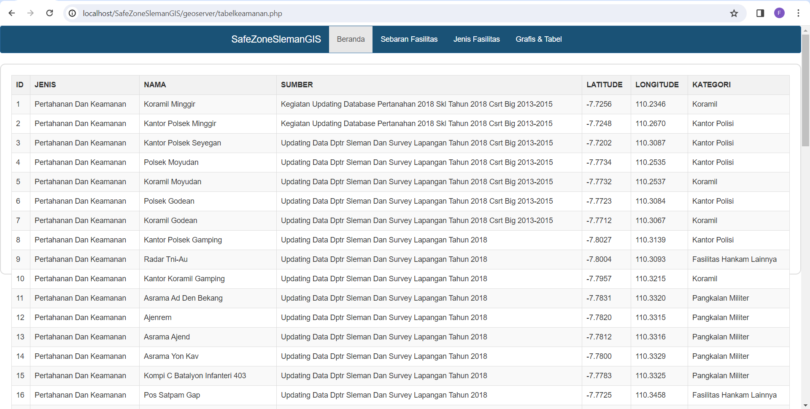
  <li>ApexCharts</li> 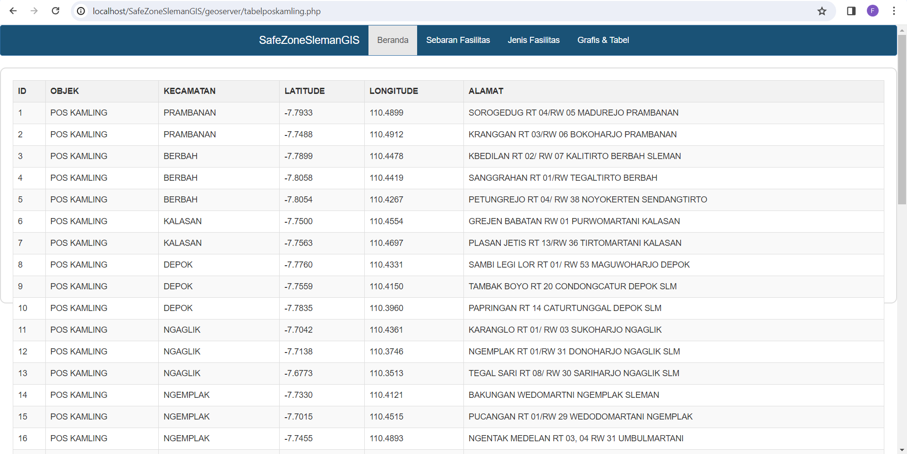
  <ol>
  
  

  

